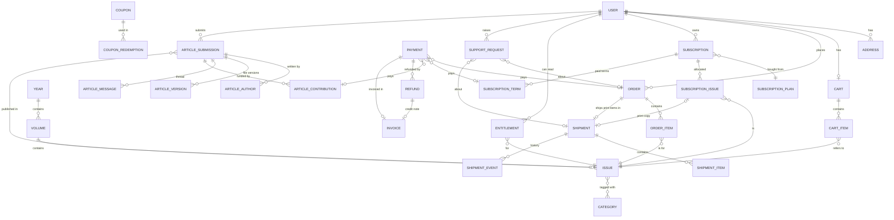

# AgriOxen Monthly — Functional Specification

**Purpose:** the complete build reference for the AgriOxen Monthly platform: what data exists, how records relate, how each status changes, what runs automatically, and what every page shows and does. It implements the plan in *AgriOxen_Platform_Plan_v3.md*.

**Changes from Plan v3**
- **Subscriptions are bought from the Plans page, not the cart.** Autopay uses a different Razorpay flow from one-time payments, and mixing them in one cart creates refund and coupon edge cases. The cart holds issues only.
- **Subscription start rule:** every subscription (digital, print, or both) starts with the **latest published issue**. For print, that copy ships from reserved stock. One rule for all formats keeps the issue counter simple.

---

## Contents

1. Conventions
2. Entity Relationship Overview
3. Data Model — every table and field
4. Status Machines
5. Business Rules
6. Automated Jobs & Webhooks
7. Key Flows (step by step)
8. Pages — Public
9. Pages — My Account
10. Pages — Admin
11. Notifications Catalogue
12. Permissions Matrix
13. Settings (admin-configurable values)
14. Decisions Still Open

---

## 1. Conventions

| Item | Rule |
|---|---|
| IDs | Every table has `id` (UUID or auto-increment) plus `created_at` and `updated_at`. These are not repeated in the tables below. |
| Money | Stored as **integer paise** (₹199.00 = 19900) to avoid rounding errors and to match Razorpay. Shown as rupees. |
| Time | Stored in UTC; shown in IST. |
| Soft delete | Tables marked *soft-delete* have `deleted_at`. Deleted rows are hidden but kept for history. |
| Snapshots | Fields ending in `_snapshot` copy a value at the moment of purchase and never change afterwards. |
| Human-readable numbers | Article: `AGX-2026-000123` · Order: `ORD-2026-000123` · Shipment: `SHP-2026-000123` · Subscription: `SUB-2026-000123` · Request: `REQ-2026-000123` · Invoice: `AGX/2026-27/00001` (sequential per financial year, required for GST) · Credit note: `AGX/CN/2026-27/00001`. |
| Enums | Written as `value_one / value_two`. |
| FK | Foreign key to another table. |

---

## 2. Entity Relationship Overview



**How the main pieces connect, in words**

- An **Issue** sits in a Volume, which sits in a Year. An issue can be sold as Digital, Print, or a Bundle of both.
- A user's **Cart** holds issues. Checkout turns the cart into an **Order**. Each **Order Item** is one issue in one format.
- **Digital** order items create an **Entitlement** (the right to read). **Print** order items go into one **Shipment** for that order. A Bundle item does both.
- A **Subscription** is bought from a **Subscription Plan**. Each paid period is a **Subscription Term** that adds a number of issues to the subscription. When an issue is published, every active subscription receives a **Subscription Issue** allocation, which creates an Entitlement (digital) and/or a Shipment (print).
- Every money movement is a **Payment** (for an order, a subscription term, or an article contribution). Money going back is a **Refund**. Each payment gets an **Invoice**; each refund gets a credit note.
- **Entitlements** alone decide who can open the reader.
- **Support Requests** cover problems with orders, shipments, subscriptions, or digital access.
- **Article Submissions** have authors, file versions, a message thread, and **Contributions** (split payments). Published articles link to an Issue.

---

## 3. Data Model

### 3.1 Accounts

**users** *(soft-delete)*

| Field | Type | Rules |
|---|---|---|
| name | string(120) | Required. |
| email | string | Required, unique, stored lowercase. |
| email_verified_at | datetime, null | Set on email verification or Google sign-in. Must be set before purchase or submission. |
| phone | string(15), null | Unique when present. Indian mobile format (10 digits, starts 6–9). |
| phone_verified_at | datetime, null | |
| password_hash | string, null | bcrypt. Null for Google-only accounts. |
| google_id | string, null | Unique. Linked to an existing account when the email matches. |
| role | enum `reader / admin` | Default `reader`. (Later: `editor / finance / super_admin`.) |
| state_id, district_id, taluk_id | FK, null | Location selection. Optional for digital buyers. |
| status | enum `active / disabled` | Disabled users cannot log in. |
| marketing_opt_in | bool | Default false. |
| last_login_at | datetime, null | |

**states**, **districts** (`state_id`), **taluks** (`district_id`): `name`, `is_active`. Existing data, unchanged.

**addresses** *(soft-delete)*

| Field | Type | Rules |
|---|---|---|
| user_id | FK users | |
| label | string(30) | e.g. Home, Office, Gift – Father. |
| recipient_name | string(120) | Required. |
| recipient_phone | string(15) | Required; courier contact. |
| line1 | string(200) | Required. House / building / street. |
| line2 | string(200), null | Area / locality. |
| landmark | string(100), null | |
| city | string(80) | Required. |
| district | string(80) | Required. |
| state_id | FK states | Required. Drives shipping fee. |
| pincode | string(6) | Required, 6 digits. |
| is_default | bool | Exactly one default per user when addresses exist. |

Addresses are **never** referenced by orders after checkout; orders and subscriptions copy them (Section 5.4).

**otp_codes**: `user_id`, `channel (email / sms)`, `destination`, `purpose (login / verify_email / verify_phone)`, `code_hash`, `attempts` (max 5), `expires_at` (10 min), `used_at`.

**password_reset_tokens**: `user_id`, `token_hash`, `expires_at` (30 min), `used_at`.

### 3.2 Catalogue

**years**, **volumes**, **categories**: existing tables, unchanged.

**issues** *(existing creation flow kept; new fields marked ★)*

| Field | Type | Rules |
|---|---|---|
| volume_id | FK volumes | Existing. |
| issue_number | int | Existing. Unique per volume. |
| is_special_edition | bool | Existing. |
| title, slug | string | Slug unique. |
| month, year | int | Cover month. |
| summary | text | |
| cover_image_key | string | Public image. |
| ★ sequence | int | Global publish order (1, 2, 3…). Set on publish. Used by subscriptions and "latest issue". |
| ★ publish_status | enum `draft / scheduled / published` | Only `published` is visible or sellable. |
| ★ publish_at | datetime, null | For `scheduled`. |
| ★ published_at | datetime, null | |
| ★ digital_available | bool | |
| ★ digital_price | int paise, null | Required if digital_available. |
| ★ digital_file_key | string, null | **Private** storage. Required before publishing if digital_available. |
| ★ page_count | int, null | |
| ★ preview_pages | int | Default 4. Pages readable without entitlement. |
| ★ print_available | bool | |
| ★ print_price | int paise, null | Required if print_available. |
| ★ print_stock_total | int | Copies printed. |
| ★ print_stock_reserved_subs | int | Copies set aside for subscribers (filled automatically on publish = active print subscriptions count). |
| ★ print_stock_sold | int | Increased when a single-copy order is paid. |
| ★ bundle_price | int paise, null | Optional; only if both formats available. |
| ★ included_in_subscription | bool | Default true. Decide for special editions (Section 14). |

Available for single sale = `print_stock_total − print_stock_reserved_subs − print_stock_sold − copies held by pending orders`.

**issue_categories**: `issue_id`, `category_id` (keep the existing relation if issues currently have a single category).

### 3.3 Cart

**carts**: `user_id` (unique).

**cart_items**

| Field | Type | Rules |
|---|---|---|
| cart_id | FK | |
| issue_id | FK issues | Must be published. |
| format | enum `digital / print / bundle` | Must be available for that issue. |
| quantity | int | Digital = 1 always. Print/bundle 1–10, limited by stock. |
| | | Unique (cart_id, issue_id, format). |

The cart stores no prices. Prices are read live and fixed only when the order is created.

### 3.4 Orders & Shipping

**orders**

| Field | Type | Rules |
|---|---|---|
| order_number | string | `ORD-YYYY-NNNNNN`. |
| user_id | FK users | |
| payment_status | enum | See 4.1. |
| has_digital | bool | Any digital or bundle item. |
| has_print | bool | Any print or bundle item. |
| subtotal | int paise | Sum of line totals before discount. |
| discount_total | int paise | |
| shipping_fee | int paise | 0 when has_print is false. |
| tax_total | int paise | |
| grand_total | int paise | Amount charged. |
| coupon_id | FK, null | |
| coupon_code_snapshot | string, null | |
| billing_name, billing_email, billing_phone | string | Snapshot. |
| billing_gstin | string(15), null | Optional, for business buyers. |
| billing_state_id | FK | Determines GST place of supply. |
| razorpay_order_id | string | Unique. |
| expires_at | datetime | created_at + 30 min while pending. |
| paid_at, cancelled_at | datetime, null | |
| display_status | enum (derived, cached) | See 4.4. |

**order_items**

| Field | Type | Rules |
|---|---|---|
| order_id | FK | |
| issue_id | FK | |
| format | enum `digital / print / bundle` | |
| title_snapshot | string | e.g. "Vol 4 · Issue 7 — June 2026". |
| unit_price | int paise | Snapshot. |
| quantity | int | |
| discount_amount | int paise | Share of the order coupon. |
| tax_rate_snapshot | decimal | |
| tax_amount | int paise | |
| line_total | int paise | |
| digital_access | enum `none / granted / revoked`, null | Null for print-only items. |
| refunded_quantity | int | For partial refunds of print quantity. |

**shipments**

| Field | Type | Rules |
|---|---|---|
| shipment_number | string | `SHP-YYYY-NNNNNN`. |
| source | enum `order / subscription / replacement` | |
| order_id | FK, null | For `order`. |
| subscription_issue_id | FK, null | For `subscription`. |
| replaces_shipment_id | FK, null | For `replacement`. |
| issue_id | FK, null | Set for subscription and replacement shipments (one issue). Used for the dispatch queue. |
| recipient_name, recipient_phone, line1, line2, landmark, city, district, state_id, pincode | snapshot | Copied at creation. |
| status | enum | See 4.2. |
| courier_name | string, null | Required to mark Shipped. |
| tracking_number | string, null | Required to mark Shipped. |
| tracking_url | string, null | |
| expected_delivery_date | date, null | |
| packed_at, shipped_at, delivered_at, cancelled_at | datetime, null | |
| failure_reason | string, null | |

**shipment_items**: `shipment_id`, `issue_id`, `quantity`, `order_item_id` (null for subscription copies).

**shipment_events**: `shipment_id`, `status`, `note`, `actor_user_id` (null = system), `occurred_at`. One row per change; shown as the tracking timeline.

**shipping_rules**: `scope (default / state)`, `state_id` (null for default), `fee` paise, `free_above` paise (null = never free), `is_active`.

### 3.5 Entitlements (reading access)

**entitlements**

| Field | Type | Rules |
|---|---|---|
| user_id | FK | |
| issue_id | FK | |
| source | enum `purchase / subscription / subscription_archive / admin_grant` | |
| order_item_id | FK, null | For `purchase`. |
| subscription_id | FK, null | For subscription sources. |
| granted_by | FK users, null | For `admin_grant`. |
| status | enum `active / revoked` | |
| granted_at, revoked_at | datetime | |
| revoke_reason | string, null | refund / subscription_ended (archive only) / admin. |

**Access rule:** a user may read an issue if **at least one** active entitlement exists for that user and issue. Several sources may exist at once (e.g. purchased and later covered by a subscription); revoking one does not remove access granted by another.

### 3.6 Subscriptions

**subscription_plans**

| Field | Type | Rules |
|---|---|---|
| name | string | e.g. "Digital — 12 Issues". |
| description | text | Shown on the Plans page. |
| format | enum `digital / print / both` | |
| issues_per_term | int | e.g. 6, 12, 24. |
| price | int paise | Per term, including GST. |
| billing_type | enum `one_time / autopay / both` | Which options the buyer sees. |
| autopay_interval_months | int, null | Usually equals issues_per_term for a monthly magazine. |
| razorpay_plan_id | string, null | Required if autopay offered. |
| includes_archive | bool | Gives reading access to all back issues while active. |
| is_active | bool | Inactive plans are hidden; existing subscribers unaffected. |
| sort_order | int | |

**subscriptions**

| Field | Type | Rules |
|---|---|---|
| subscription_number | string | `SUB-YYYY-NNNNNN`. |
| user_id | FK | |
| plan_id | FK | |
| plan_name_snapshot, format_snapshot, issues_per_term_snapshot, price_snapshot, includes_archive_snapshot | snapshot | Plan edits never change existing subscriptions. |
| billing_type | enum `one_time / autopay` | |
| status | enum | See 4.3. |
| issues_remaining | int | Increased by each paid term, decreased by each allocated issue. |
| issues_allocated | int | Total received so far. |
| first_issue_id | FK issues, null | |
| last_issue_id | FK issues, null | |
| razorpay_subscription_id | string, null | Autopay. |
| autopay_enabled | bool | False once user switches off. |
| next_charge_at | datetime, null | From Razorpay. |
| grace_until | datetime, null | Set when a renewal fails. |
| coupon_id | FK, null | |
| delivery fields (recipient_name … pincode) | snapshot, null | Required when format is print or both. |
| address_change_cutoff | — | Not stored; computed as each issue's publish date minus the setting (Section 13). |
| started_at, ended_at, cancelled_at | datetime, null | |
| cancel_reason | string, null | |

**subscription_terms** (one row per paid period)

| Field | Type | Rules |
|---|---|---|
| subscription_id | FK | |
| term_number | int | 1, 2, 3… |
| issues_added | int | |
| amount | int paise | |
| payment_id | FK payments, null | Null until paid. |
| status | enum `pending / paid / failed / refunded` | |
| paid_at | datetime, null | |

**subscription_issues** (one row per issue delivered to a subscription)

| Field | Type | Rules |
|---|---|---|
| subscription_id | FK | |
| issue_id | FK | Unique (subscription_id, issue_id). |
| term_number | int | Which paid term it counts against. |
| entitlement_id | FK, null | Digital / both. |
| shipment_id | FK, null | Print / both. |
| allocated_at | datetime | |

### 3.7 Payments, Refunds, Invoices

**payments**

| Field | Type | Rules |
|---|---|---|
| user_id | FK, null | Null for article contributors who are not registered. |
| purpose | enum `order / subscription_term / article_contribution` | |
| order_id / subscription_term_id / article_contribution_id | FK, null | Exactly one set. |
| amount | int paise | |
| razorpay_order_id | string, null | |
| razorpay_payment_id | string, null | Unique. |
| razorpay_subscription_id | string, null | |
| method | string, null | upi / card / netbanking / wallet. |
| status | enum `created / captured / failed / partially_refunded / refunded` | Set **only** from verified Razorpay data. |
| failure_reason | string, null | |
| captured_at | datetime, null | |
| refunded_amount | int paise | |

**refunds**

| Field | Type | Rules |
|---|---|---|
| payment_id | FK | |
| amount | int paise | ≤ payment.amount − payment.refunded_amount. |
| reason | enum `order_cancelled / damaged / not_received / duplicate / access_failure / subscription_cancelled / article_withdrawn / article_rejected / overpayment / other` | |
| note | text, null | |
| support_request_id | FK, null | |
| razorpay_refund_id | string, null | |
| status | enum `pending / processed / failed` | |
| initiated_by | FK users, null | Null when the system refunds automatically. |
| processed_at | datetime, null | |

**invoices**

| Field | Type | Rules |
|---|---|---|
| invoice_number | string | Sequential per financial year, no gaps. |
| type | enum `invoice / credit_note` | |
| payment_id | FK | |
| refund_id | FK, null | For credit notes. |
| original_invoice_id | FK, null | For credit notes. |
| billed_to_name, email, phone, gstin, state_id, address | snapshot | |
| lines | json | Description, SAC/HSN, quantity, taxable value, tax rate, CGST/SGST or IGST, total. |
| taxable_total, cgst, sgst, igst, grand_total | int paise | Intra-state = CGST + SGST; inter-state = IGST. |
| pdf_key | string | Private file. |
| issued_at | datetime | |

**webhook_events**: `provider`, `event_id` (unique — guarantees each event is processed once), `event_type`, `payload` json, `status (received / processed / failed / ignored)`, `error`, `processed_at`.

### 3.8 Coupons

**coupons**

| Field | Type | Rules |
|---|---|---|
| code | string(30) | Unique, uppercase, letters/numbers. |
| description | string | Internal note. |
| discount_type | enum `flat / percent` | |
| discount_value | int | Paise for flat; 1–100 for percent. |
| max_discount | int paise, null | Cap for percent. |
| applies_to | enum `issues / subscriptions / both` | |
| formats | array of `digital / print / bundle`, null | Null = all. Issues only. |
| plan_ids | array, null | Null = all plans. Subscriptions only. |
| min_order_value | int paise, null | |
| starts_at, ends_at | datetime, null | |
| total_limit | int, null | |
| per_user_limit | int | Default 1. |
| first_term_only | bool | Autopay: discount on term 1 only. Default true. |
| is_active | bool | |

**coupon_redemptions**: `coupon_id`, `user_id`, `order_id` / `subscription_id`, `discount_amount`, `status (reserved / confirmed / released)`, `reserved_until`. Limits count `confirmed` + unexpired `reserved`.

### 3.9 Support Requests

**support_requests**

| Field | Type | Rules |
|---|---|---|
| request_number | string | `REQ-YYYY-NNNNNN`. |
| user_id | FK | |
| type | enum `damaged / wrong_issue / missing_pages / not_received / digital_access / duplicate_purchase / subscription_query / other` | |
| order_id, order_item_id, shipment_id, subscription_id | FK, null | At least one, depending on type (5.8). |
| description | text | Required, 20–2000 chars. |
| attachment_keys | array | Up to 3 images, 5 MB each. Required for damaged / wrong_issue / missing_pages. |
| status | enum | See 4.5. |
| resolution | enum `replace / refund / access_restored / no_action`, null | |
| resolution_note | text, null | Shown to the user. |
| replacement_shipment_id | FK, null | |
| refund_id | FK, null | |
| handled_by | FK users, null | |
| resolved_at | datetime, null | |

**support_messages**: `support_request_id`, `sender_user_id`, `is_staff`, `body`, `created_at`. Conversation thread on the request.

### 3.10 Article Submissions

**article_themes**: `name`, `is_active`, `sort_order`.

**article_submissions**

| Field | Type | Rules |
|---|---|---|
| article_code | string | `AGX-YYYY-NNNNNN`. Existing. |
| submitter_user_id | FK users | |
| theme_id | FK | |
| title | string(250) | |
| language | enum (English / Kannada / Hindi / …) | |
| status | enum | See 4.6. |
| current_version_id | FK article_versions | |
| declaration_accepted_at | datetime | Required. |
| publication_charge | int paise, null | Set on acceptance. |
| amount_paid | int paise | Sum of paid contributions (cached). |
| balance | int paise | charge − paid (cached). |
| payment_token | string(40), null | Random, unique; used in the public payment link. |
| payment_deadline | datetime, null | Acceptance + setting. |
| revision_comments | text, null | |
| rejection_reason | text, null | |
| hold_reason | text, null | |
| scheduled_issue_id | FK issues, null | Chosen from existing issues. |
| page_from, page_to | int, null | |
| published_at | datetime, null | |
| article_url | string, null | |
| withdrawn_at | datetime, null | |
| withdraw_reason | text, null | |

**article_authors**: `submission_id`, `is_primary`, `position`, `salutation`, `name`, `email`, `phone`, `affiliation`, `designation`, `city`, `state`, `country`, `user_id` (linked if an account with that email exists). Exactly one primary.

**article_versions**: `submission_id`, `version_number`, `file_key` (private), `original_filename`, `mime_type` (checked from file content), `size_bytes` (≤ 10 MB), `server_word_count`, `uploaded_by`, `note`.

**article_messages**: `submission_id`, `sender_user_id`, `is_staff`, `body`, `read_by_author_at`, `read_by_staff_at`.

**article_contributions**

| Field | Type | Rules |
|---|---|---|
| submission_id | FK | |
| contributor_name, contributor_email, contributor_phone | string | Required; invoice is issued in this name. |
| contributor_gstin | string, null | Optional. |
| amount | int paise | ≥ minimum setting and ≤ balance available (5.9). |
| status | enum `pending / paid / failed / expired / refunded` | Pending expires after 30 min. |
| payment_id | FK, null | |
| invoice_id | FK, null | |
| paid_at | datetime, null | |

**article_status_history**: `submission_id`, `from_status`, `to_status`, `actor_user_id`, `note`, `occurred_at`.

### 3.11 Platform

**site_content** (Home editor, existing): `key`, `value` json.
**settings**: `key`, `value` json (see Section 13).
**tax_rates**: `product_type (digital_issue / print_issue / subscription_digital / subscription_print / publication_charge / shipping)`, `rate_percent`, `hsn_sac_code`, `effective_from`.
**email_log**: `user_id`, `to`, `template`, `entity_type`, `entity_id`, `status (queued / sent / failed)`, `provider_message_id`, `error`, `sent_at`.
**audit_log**: `actor_user_id`, `action`, `entity_type`, `entity_id`, `before` json, `after` json, `ip`, `created_at`. Written for every admin change and every money or status change.

---

## 4. Status Machines

Only the listed transitions are allowed. Every transition writes a history row (shipment_events, article_status_history, or audit_log).

### 4.1 Order payment status

```
pending ──(webhook payment.captured)──► paid
pending ──(webhook payment.failed)───► failed ──(user retries)──► pending
pending ──(30 min, no payment)───────► expired
paid ──(refund of part)──► partially_refunded ──(rest refunded)──► refunded
paid ──(full refund)─────► refunded
```

On **paid**: grant entitlements for digital/bundle items; create the print shipment; confirm stock and coupon; issue invoice; empty matching cart items; send confirmation.
On **expired / failed**: release held stock and coupon reservation. Nothing is granted.

### 4.2 Shipment status

```
awaiting_dispatch ──► packed ──► shipped ──► delivered
awaiting_dispatch / packed ──► cancelled          (user or admin, before shipped)
shipped ──► delivery_failed ──► returned_to_sender ──► (admin) reship → new replacement shipment
                                                  └──► (admin) refund
```

- `shipped` requires courier name and tracking number.
- `delivered` is set by the admin (or the courier integration later). If not marked within the setting's days after shipped, the admin dashboard flags it.
- Digital items never have a shipment.

### 4.3 Subscription status

```
pending_payment ──(first term paid)──► active
pending_payment ──(30 min / failed)──► abandoned

active ──(issues_remaining = 0, one_time)─────────────► ended
active ──(issues_remaining = 0, autopay, next charge pending)──► stays active, waits for renewal
active ──(autopay renewal charged)─────────────────────► active (+issues)
active ──(autopay renewal failed)──────────────────────► payment_failed (grace_until = now + grace days)
payment_failed ──(retry succeeds in grace)─────────────► active
payment_failed ──(grace over)──────────────────────────► ended
active ──(user switches off autopay)───────────────────► non_renewing
non_renewing ──(issues_remaining = 0)──────────────────► ended
non_renewing ──(user switches autopay back on, before end)──► active
active / non_renewing ──(admin cancels with refund)────► cancelled
```

User-facing labels: pending_payment → "Awaiting payment" · active → "Active" · payment_failed → "Payment failed — update payment by {date}" · non_renewing → "Active — ends after {n} more issues" · ended → "Ended" · cancelled → "Cancelled".

### 4.4 Order display status (derived, never edited)

| Condition | Label |
|---|---|
| payment pending | Awaiting payment |
| payment failed | Payment failed |
| payment expired | Expired |
| fully refunded | Refunded |
| paid, digital only | Completed |
| paid, shipment awaiting_dispatch / packed | Processing |
| paid, shipment shipped | Shipped |
| paid, shipment delivered | Delivered |
| paid, shipment cancelled, digital items remain | Completed (print cancelled) |
| paid, shipment cancelled, no digital items | Cancelled |

### 4.5 Support request status

```
open ──► in_review ──► approved ──► resolved (replacement shipped / refund processed / access restored) ──► closed
                  └──► rejected ──► closed
open / in_review ──(user withdraws)──► closed
```

Auto-close 7 days after `resolved` or `rejected` if the user doesn't reply.

### 4.6 Article submission status

```
submitted ──► under_review
under_review ──► revision_requested ──(author uploads new version)──► resubmitted ──► under_review
under_review ──► on_hold ──► under_review
under_review ──► rejected
under_review ──► accepted_payment_pending ──(first contribution)──► partially_paid ──(balance 0)──► paid
accepted_payment_pending / partially_paid ──(deadline passed)──► payment_expired ──(editor extends)──► previous status
                                                                                   └──(editor rejects)──► rejected (refund contributions)
paid ──► scheduled ──► published
any status before paid ──(author withdraws)──► withdrawn (refund contributions, if any)
```

`paid` and `scheduled` can't be withdrawn by the author; only an editor can reverse them, with a refund.

---

## 5. Business Rules

### 5.1 Pricing & tax
- Prices shown to buyers **include GST**. The invoice breaks GST out.
- Place of supply = billing state. Same state as the business → CGST + SGST; other state → IGST.
- Bundle price applies only when both formats are available; otherwise the bundle option is hidden.
- Prices on the order are fixed at checkout. Admin price changes affect only new orders.

### 5.2 Cart
- Only published issues with the chosen format available can be added.
- Digital and bundle lines are refused if the user already has an active entitlement for that issue. Message: "Already in your library."
- A print line for an issue the user already owns digitally is allowed.
- Quantity for print/bundle is capped by available stock (3.2) and by the setting `max_print_qty_per_line`.
- The cart re-checks availability and prices every time it loads; changed lines are flagged ("Price changed", "Print sold out — switch to digital?").

### 5.3 Checkout & payment
1. Server recalculates every line, coupon, shipping, and tax.
2. Server creates the order (`pending`), holds print stock, reserves the coupon, creates the Razorpay order.
3. Browser opens Razorpay. On return, the browser calls *verify*, which checks the signature and shows "Payment received — confirming…".
4. The order becomes `paid` **only** when the webhook (or the verified return, whichever first) is confirmed and recorded once (webhook_events / unique payment id).
5. A user may have at most 3 pending orders at once.

### 5.4 Addresses
- Asked for only when the order has print items or the subscription is print/both.
- The chosen address is copied into the shipment/subscription. Editing or deleting the address book entry later changes nothing already placed.
- Subscription address changes apply to issues not yet allocated. Changes after the cut-off apply from the following issue.

### 5.5 Entitlements
- Created: on order paid (digital/bundle items); on subscription issue allocation (digital/both); on archive plans for all published issues while active; by admin grant.
- Revoked: on refund of that order item; on admin action; `subscription_archive` entitlements are revoked when the subscription ends. Regular subscription entitlements are **kept** after the subscription ends.

### 5.6 Subscriptions
- **Start:** on activation, the latest published issue (with `included_in_subscription`) is allocated immediately.
- **Each new issue:** when an issue is published, every subscription in `active` or `non_renewing` with `issues_remaining > 0` gets it allocated (Job J4).
- **Terms add issues.** A one-time renewal or autopay charge adds `issues_per_term` to `issues_remaining`.
- **Duplicates:** a user can't start a second subscription with the same plan *and* the same delivery address (or same plan, for digital) while one is active. They are offered "Renew / extend" instead, which adds a term to the existing subscription.
- **Gift subscriptions:** a second print subscription to a different address is allowed.
- **Autopay grace:** during `payment_failed`, issues already allocated stay readable; no new issues are allocated until payment succeeds.
- **Switching off autopay** cancels the Razorpay subscription at the end of the current cycle; remaining issues are still delivered.

### 5.7 Cancellations & refunds
| Case | Who | Rule | Refund |
|---|---|---|---|
| Print shipment not yet shipped | User (self-service) or admin | Cancels the whole shipment. | Print lines + shipping fee, automatic. |
| Digital item | Admin only | Only for duplicate purchase or access failure (via support request). | That line; entitlement revoked. |
| One-time subscription | Admin | Before the first issue is allocated: full. After: none by default (policy). | Per policy. |
| Autopay subscription | User switches off autopay | No refund for the current term. | — |
| Article contribution | System / admin | On rejection, withdrawal, or payment_expired → reject. | Each contribution, full. |
| Overpayment (should never happen) | System | Refund the excess automatically. | Excess. |

All refunds go through the Razorpay refund API and produce a credit note.

### 5.8 Support requests
| Type | Allowed when | Needs | Typical resolution |
|---|---|---|---|
| damaged / wrong_issue / missing_pages | Shipment delivered, within `problem_window_days` | Photo | Replace (new shipment, source = replacement) or refund |
| not_received | Shipment shipped and past expected date + 3 days, or subscription issue not received | — | Replace or refund |
| digital_access | Paid digital item or subscription | — | Access restored, or refund |
| duplicate_purchase | Two paid orders with the same digital issue | — | Refund duplicate |
| subscription_query / other | Any time | — | No action / note |

One open request per shipment or order item at a time.

### 5.9 Article contributions
- The charge is set on acceptance and must be greater than zero. The editor may change it later, but never below `amount_paid`.
- **Available balance** = charge − paid − pending (unexpired) contributions. A new contribution must be ≥ `min_contribution` and ≤ available balance — except when the available balance is below the minimum, in which case it must equal the balance.
- The check and the insertion of the pending contribution happen in one database transaction with a lock on the submission row, so two people can never overpay.
- The public payment page shows: article code, title, total charge, paid so far, balance, deadline. **No names, emails, or phone numbers** of other authors or contributors.
- The link stops accepting payments when status is not `accepted_payment_pending` / `partially_paid`.

### 5.10 Validation essentials
- Email: valid format, lowercase, unique. Phone: 10-digit Indian mobile. PIN code: 6 digits.
- Passwords: minimum 8 characters, not equal to email.
- Manuscript: .doc/.docx verified by file signature, ≤ 10 MB; word count computed on server and shown to editors (warning above 2,000).
- Images (support photos): JPG/PNG/WebP, ≤ 5 MB, max 3.
- Rate limits: login 5 / 15 min per account and 20 / 15 min per IP; OTP send 3 / 15 min per destination; password reset 3 / hour per account; coupon apply 10 / hour per user.

---

## 6. Automated Jobs & Webhooks

### 6.1 Webhooks (Razorpay)
Every webhook: verify signature → store in webhook_events (skip if event_id already processed) → act → mark processed. Unknown events are stored as `ignored`.

| Event | Action |
|---|---|
| payment.captured | Mark the related payment `captured`; then order → paid, or subscription term → paid (+issues, activate), or contribution → paid (update balance, status). |
| payment.failed | Mark payment `failed`; order → failed; contribution → failed (releases the reserved amount). |
| subscription.charged | Create the new term's payment as captured; add issues; status → active; clear grace. |
| subscription.halted / subscription.pending | Status → payment_failed; set grace_until; email the user. |
| subscription.cancelled | Status → non_renewing (or ended if no issues remain). |
| refund.processed / refund.failed | Update refund status; update payment refunded amount; issue credit note; email the user. |

### 6.2 Scheduled jobs

| # | Job | Runs | Does |
|---|---|---|---|
| J1 | Expire pending orders | Every 5 min | Pending orders past expires_at → expired; release stock and coupon. Also checks Razorpay once before expiring, in case a webhook was missed. |
| J2 | Expire pending contributions | Every 5 min | Pending contributions older than 30 min → expired; balance released. |
| J3 | Publish scheduled issues | Every 5 min | Issues with publish_at ≤ now → published (then J4). |
| J4 | Allocate issue to subscribers | On every publish | For each eligible subscription (5.6): create subscription_issue; entitlement (digital/both); shipment (print/both, status awaiting_dispatch); decrement issues_remaining; end one-time subscriptions that reach 0; reserve print stock; send "new issue" emails. Safe to re-run (unique subscription_id + issue_id). |
| J5 | Article payment reminders | Daily 9:00 IST | Reminders at deadline − 7 days and − 2 days; past deadline → payment_expired and editor notified. |
| J6 | Subscription grace expiry | Hourly | payment_failed past grace_until → ended. |
| J7 | Renewal & expiry reminders | Daily | Autopay: pre-debit notice before charge (if not sent by Razorpay). One-time: "2 issues left — renew" and "ended" emails. |
| J8 | Auto-close requests | Daily | Resolved/rejected support requests idle 7 days → closed. |
| J9 | Shipment overdue flags | Daily | Shipped > N days without delivered → dashboard flag. |
| J10 | Release cart stock warnings | Daily | Notify users whose cart items became unavailable (optional). |
| J11 | Backups | Daily | Database backup; weekly restore test. |

---

## 7. Key Flows

### 7.1 Buy a digital issue
1. Issue page → choose **Digital** → Add to cart (refused if already owned).
2. Cart → Checkout. Profile gate asks only for phone if missing. **No address step.**
3. Review page: items, coupon, GST included, total → Pay.
4. Razorpay → return → "Confirming payment…" → webhook → order paid.
5. Result page: "Ready to read" with **Read now**. Order shows **Completed**. Issue appears in My Library. Invoice emailed.

### 7.2 Buy a print issue (or mixed cart)
1. Add print/bundle lines.
2. Checkout → choose or add address → shipping fee shown → review → pay.
3. Paid → shipment `awaiting_dispatch`; digital lines readable at once.
4. Admin dispatch queue → packed → shipped (courier + tracking) → user emailed with tracking link → delivered.
5. User may cancel from Order Detail until shipped; may report a problem after delivery.

### 7.3 Subscribe
1. Plans page → choose plan → choose **Pay once** or **Autopay** (if offered).
2. Print/both → choose or add delivery address (can be a gift address).
3. Coupon → review (shows "Starts with: June 2026 issue · 12 issues") → pay (Razorpay order or Razorpay subscription mandate).
4. Paid → subscription active → latest issue allocated at once → appears in library / dispatch queue.
5. Each new issue → J4 allocates it.
6. One-time: at 2 issues left → renew email → renew adds a term. Autopay: Razorpay charges → webhook adds a term.

### 7.4 Admin publishes an issue
1. Issue edit → upload digital file, set prices, stock → **Publish now** or **Schedule**.
2. System checks: digital file present (if digital), prices set, print stock ≥ active print subscriptions (warning if not).
3. Publish → sequence assigned → J4 allocates to subscribers → dispatch queue fills → "New issue" emails sent.

### 7.5 Problem with a delivered copy
1. Order Detail or Subscription Detail → **Report a problem** → type, description, photo.
2. Admin reviews → **Replace** (new replacement shipment enters dispatch queue) or **Refund** (Razorpay refund → credit note) or **Reject** (with reason).
3. User sees status and messages on the request page.

### 7.6 Article: accept → split payment → publish
1. Editor accepts with a charge → status accepted_payment_pending → token and deadline created → authors emailed the link.
2. Any author opens the link → enters name, email, phone, amount (pre-filled with balance) → pays.
3. Each payment: contribution paid → balance updated → status partially_paid or paid → contributor gets invoice; primary author notified.
4. Paid → editor schedules into an existing issue with page range → status scheduled → published (date + URL) → appears in that issue's table of contents.

---

## 8. Pages — Public

Each page lists what it shows, the input fields, and the actions.

### P1 Home *(Built)*
Shows hero, latest issue, categories, recent issues, stats, About, contact — all from site_content. Add a "Subscribe" call-to-action linking to P6.

### P2 Archive *(Built)*
Filters: Year, Volume, Category, Issue number. Cards: cover, title, month/year, formats available with prices, "In your library" badge if entitled.

### P3 Category page *(Built)*
Same cards as P2, filtered by category.

### P4 Issue detail *(Change)*
| Section | Content |
|---|---|
| Header | Cover, title, volume/issue, month, special edition badge, categories. |
| Summary | Issue summary. |
| Table of contents | Published articles in this issue: title, authors, page range. |
| Preview | Read first `preview_pages` pages (no login needed). |
| Buy box | Format selector: Digital ₹x · Print ₹y (stock note) · Bundle ₹z. Quantity (print/bundle). Add to cart. If already owned: **Read now** instead of Digital. If subscribed and covered: "Included in your subscription". Link: "Get every issue — Subscribe". |

### P5 Reader *(Change)*
Access: active entitlement, otherwise only preview pages and a buy prompt. Page images loaded via short-lived signed URLs. Controls: page navigation, zoom, fit width, thumbnails, full screen. Watermark with user email. Remembers last page.

### P6 Subscription plans *(New)*
Plan cards grouped by format: name, issues per term, price, per-issue saving vs single price, "Includes archive" badge, Pay once / Autopay. Plain-language rules: when it starts, what happens at the end, how to cancel autopay, print dispatch timing. Button: **Subscribe** → P8. If the user already has the same plan active: **Extend** instead.

### P7 Cart *(Change)*
Lines: cover, title, format, unit price, quantity (print/bundle), line total, remove. Warnings: price changed, sold out (offer switch to digital), already owned (remove). Summary: subtotal, estimated shipping ("calculated at checkout" if print), total. Button: Checkout (requires login + verified email).

### P8 Checkout *(Change)* — one page with steps; steps shown depend on cart

| Step | Shown when | Fields |
|---|---|---|
| 1 Contact | Always | Name, email (read-only), phone (required). Optional: GSTIN, billing state. |
| 2 Delivery address | Cart has print/bundle, or subscription is print/both | Choose saved address (radio) or add new: recipient name, phone, line 1, line 2, landmark, city, district, state, PIN code, label, "save to address book". |
| 3 Review | Always | Lines, coupon field (apply/remove), subtotal, discount, shipping (print only), GST included, **total**. For subscriptions: plan, billing type, "Starts with {issue}", issues, autopay terms and next charge date. Checkbox: agree to Terms and Refund Policy. |
| Pay | | Opens Razorpay. |

### P9 Payment result *(New)*
States: **Confirming** (auto-refreshes until webhook arrives, max ~60 s, then "We'll email you when confirmed"), **Success** (order/subscription number, Read now for digital, "We'll email tracking" for print, View order), **Failed** (reason, Retry payment, Back to cart).

### P10 Login *(Built + Change)*
Email + password; "Sign in with OTP"; "Sign in with Google"; Forgot password. Generic error messages. Rate limited.

### P11 Register *(Built + Change)*
Name, email, phone (optional at sign-up, required before first order), password, confirm password, state → district → taluk (optional), accept Terms. After submit → P12.

### P12 Verify email *(New)*
"We sent a link/code to {email}". Enter 6-digit code or click link. Resend (rate-limited). Change email.

### P13 OTP sign-in, P14 Forgot password, P15 Reset password *(Built)*
OTP: email or phone → code (6 digits). Same message whether or not the account exists.

### P16 Submit article *(Built)*
Theme, title, language, primary author fields, co-authors (add/remove), manuscript upload, declaration checkboxes. Guidelines link. Server returns word-count warning if above limit.

### P17 Article contribution payment (public link) *(Change)*
Shows article code, title, total charge, paid so far, balance, deadline. Fields: name, email, phone, GSTIN (optional), amount (default = balance; min/max shown). Pay → Razorpay → result with receipt. If fully paid or closed: "This article's charge has been fully paid" / "This payment link is no longer active."

### P18 Legal & info *(New)*
Privacy Policy, Terms of Service, Refund & Cancellation Policy, Shipping & Delivery Policy, Contact Us (address, email, phone, contact form), Author Guidelines, FAQ.

### P19 System pages
Unauthorized (built), 404, 500, maintenance.

---

## 9. Pages — My Account

Left menu: Overview · My Library · Orders · Subscriptions · Article Submissions · Payments & Invoices · Help Requests · Addresses · Profile · Security.

### A1 Overview *(New)*
Cards: latest issue in library (Read now), active subscriptions (status, issues left), recent orders (status), open help requests, submissions needing action (revision requested, payment pending).

### A2 My Library *(New)*
Grid of issues with an active entitlement. Each: cover, title, month, source badge (Purchased · Subscription · Archive access until {date} · Gift from admin), Read now, Continue from page {n}. Filters: year, category, source. Search by title. Empty state links to Archive and Plans.

### A3 Orders list *(Change)*
Columns: order number, date, items summary ("2 issues · Digital + Print"), total, status label (4.4). Filters: status, date range. Row → A4.

### A4 Order detail *(New)*
| Section | Content |
|---|---|
| Header | Order number, date, status label, total. |
| Items | Per line: cover, title, format, qty, price, line total, digital access state (Read now / Access revoked). |
| Price breakdown | Subtotal, coupon (code), shipping, GST included, total, refunded so far. |
| Payment | Method, Razorpay payment ID, paid at, status. |
| Billing | Name, email, phone, GSTIN. |
| Delivery *(print only)* | Address snapshot; shipment number; timeline (shipment_events) with dates; courier, tracking number, tracking link; expected delivery. |
| Documents | Download invoice; download credit note(s). |
| Actions | Retry payment (failed/pending) · Cancel print shipment (before shipped, confirm dialog showing refund amount) · Report a problem (eligible items) · Contact support. |

### A5 Subscriptions list *(New)*
Cards: subscription number, plan, format, status label, issues received / remaining, next charge date (autopay) or "Renew" (one-time).

### A6 Subscription detail *(New)*
| Section | Content |
|---|---|
| Summary | Plan, format, billing type, status, started, issues received, issues remaining, archive access. |
| Renewal | Autopay: on/off toggle, next charge date and amount, payment method note. One-time: Renew button. Payment failed: "Update payment" link with grace deadline. |
| Delivery *(print)* | Address; Change address (form as P8 step 2; shows from which issue it applies). |
| Issues | List of allocated issues: issue, date, Read now (digital), shipment status and tracking (print), Report not received. |
| Payments | Terms: term number, amount, paid date, invoice download. |
| Actions | Switch off autopay (confirm: "You will still receive {n} remaining issues"), Contact support. |

### A7 Report a problem *(New)*
Pre-filled with the order/shipment/subscription issue. Fields: type (only allowed types for this item, per 5.8), description, photos (required for damage types). Submit → A9.

### A8 Help requests list & A9 Request detail *(New)*
List: request number, type, related order/subscription, status, last update. Detail: info, photos, status timeline, message thread (reply box), resolution and links to replacement shipment or refund.

### A10 Article submissions list *(Built)*
Columns: Article ID, title, theme, submitted date, status, payment progress (paid / charge), action needed badge.

### A11 Submission detail *(Change)*
Tabs or sections: Details & authors · Versions (download each; upload revision when revision_requested) · Messages · Payment (charge, paid, balance, deadline, contributions list with name and amount — visible to the submitter only, copy/share link, WhatsApp/email share, pay now) · Publication (issue, pages, published date, URL) · Withdraw (before paid, with reason; shows refund note if contributions exist).

### A12 Payments & Invoices *(New)*
All payments: date, purpose (Order / Subscription / Article contribution), reference number, amount, status, invoice / credit note download.

### A13 Addresses *(New)*
List with default badge; add, edit, delete, set default. Note: "Changes don't affect orders already placed."

### A14 Profile *(Change)*
Name, email (change requires re-verification), phone (change requires OTP when SMS enabled), state/district/taluk, marketing emails toggle.

### A15 Security *(Change)*
Change password (current, new, confirm) or Set password for Google-only accounts; linked Google account; sign out of all devices; request data export; delete account (explains that invoices are retained by law).

---

## 10. Pages — Admin

### D1 Dashboard *(Change)*
Today / 7 days: revenue, orders paid, new subscriptions, failed payments. Action queues with counts and links: shipments awaiting dispatch, overdue shipments, open help requests, refunds pending, articles awaiting review, articles in payment, autopay failures. Recent activity (audit log).

### D2 Home content editor, D3 Years/Volumes/Issues creation, D4 Categories *(Built — unchanged)*

### D5 Issue edit *(Change — fields added to existing issue screen)*
Sections: Details (existing) · Formats & prices (digital on/off + price, print on/off + price, bundle price) · Files (digital file upload — private, page count, preview pages, cover) · Print stock (total printed, reserved for subscribers [auto], sold, available) · Subscription (included_in_subscription) · Publishing (draft / schedule date / publish now, with pre-publish checklist) · Table of contents (articles scheduled into this issue, read-only, links to D16).

### D6 Subscription plans *(Change)*
List: name, format, issues, price, billing types, active subscribers, active toggle. Form: all subscription_plans fields; Razorpay plan ID created automatically when autopay is enabled. Price edits warn that existing subscribers keep their price.

### D7 Coupons *(Change)*
List: code, type/value, applies to, valid dates, used / limit, active toggle. Form: all coupon fields. Detail: redemptions list (user, order/subscription, discount, date).

### D8 Orders *(Change)*
List: order number, date, customer, items summary, formats, total, payment status, display status. Filters: payment status, has print, date, coupon. Search: order number, email, phone, Razorpay ID. Export CSV.
Detail: everything in A4 plus customer link, coupon, payment record, refund history, audit trail. Actions: Refund (select lines/quantity, amount auto-calculated, reason) · Cancel shipment (before shipped) · Resend confirmation · Grant/Revoke access (digital lines).

### D9 Dispatch queue *(New)*
Tabs: **By issue** (the main monthly view) · **Single orders** · **Replacements** · **All shipments**.
Per issue: counts (subscription copies, single orders, replacements; awaiting / packed / shipped / delivered); table: shipment number, source, recipient, city, state, PIN, qty, status. Bulk actions: Mark packed · Export for courier (CSV) · Print address labels (PDF) · Import tracking (CSV: shipment number, courier, tracking number) → mark shipped · Mark delivered. Filters: status, state, source.

### D10 Shipment detail *(New)*
Address, items, source (link to order/subscription), status timeline, courier fields, actions per allowed transition (4.2), create replacement, linked help requests.

### D11 Help requests *(Change — replaces "Returns")*
List: request number, type, user, related item, status, age. Filters: type, status. Detail: info, photos, thread (reply), related order/shipment/subscription summary. Actions: Approve → Replace (creates replacement shipment) / Refund (amount, reason) / Restore access · Reject (reason required) · Close.

### D12 Subscriptions *(Change)*
List: subscription number, user, plan, format, billing type, status, issues remaining, next charge. Filters: status, format, billing type, ending within 2 issues.
Detail: summary, terms & payments, allocated issues with shipment status, delivery address (edit), audit trail. Actions: Change address · Add complimentary issues (compensation, reason) · Allocate a specific issue manually · Cancel (with or without refund) · Resend emails.

### D13 Users *(Change)*
List: name, email, phone, role, status, registered, orders count, active subscriptions. Detail tabs: profile, addresses, orders, subscriptions, library (entitlements with sources), submissions, help requests, payments. Actions: disable/enable, grant issue access (reason), resend verification, change role (super admin only).

### D14 Payments *(New)*
List of all payments: date, purpose, reference, payer, amount, method, status, Razorpay ID. Filters: purpose, status, date. Link to source record.

### D15 Refunds & Invoices *(New)*
Refunds: date, payment, amount, reason, status, initiated by. Invoices: number, type, date, billed to, total, download. Export for accountant (CSV by date range).

### D16 Article submissions *(Built + Change)*
Existing list, search, counts, CSV. Detail additions: contribution list with refund action, deadline (extend), charge edit (rule 5.9), schedule by choosing an existing issue + page range, status history, server word count warning.

### D17 Reports *(New)*
Sales by month and format; subscriptions (new, renewed, ended, active by format); article charges collected; GST summary (taxable value and tax by rate, intra/inter-state) for filing; top-selling issues. Date range, CSV export.

### D18 Settings *(New)*
All values in Section 13, shipping rules, tax rates, business details printed on invoices (legal name, address, GSTIN, state).

### D19 Audit log *(New)*
Filter by user, entity, action, date. Shows before/after.

### D20 System health *(New, optional)*
Webhook events (failed ones with retry), email log (failed sends with resend), scheduled job last-run times.

---

## 11. Notifications Catalogue

| # | Trigger | To | Channel | Content |
|---|---|---|---|---|
| N1 | Registration | User | Email | Verify email code/link. |
| N2 | Password changed / reset | User | Email | Security notice. |
| N3 | Order paid | Buyer | Email | Items, total, invoice PDF, Read now / "we'll ship soon". |
| N4 | Payment failed | Buyer | Email | Retry link (valid until expiry). |
| N5 | Shipment shipped | Recipient's account owner | Email (+SMS) | Courier, tracking link. |
| N6 | Shipment delivered | Owner | Email | Report-a-problem link and window. |
| N7 | Shipment cancelled / refund processed | Buyer | Email | Amount, credit note. |
| N8 | Help request updated | Requester | Email | Status, staff reply. |
| N9 | Subscription started | Subscriber | Email | Plan, first issue, invoice. |
| N10 | New issue available | Digital subscribers | Email | Read now. |
| N11 | Your copy dispatched | Print subscribers | Email (+SMS) | Tracking. |
| N12 | Pre-debit notice | Autopay subscriber | Email/SMS | Amount and date (if Razorpay doesn't send). |
| N13 | Renewal charged | Subscriber | Email | Invoice, issues added. |
| N14 | Renewal failed | Subscriber | Email | Update payment by grace date. |
| N15 | 2 issues left (one-time) / subscription ended | Subscriber | Email | Renew link. |
| N16 | Autopay switched off | Subscriber | Email | Remaining issues, re-enable link. |
| N17 | Article emails (existing 9) | Primary author (+ co-authors for accepted, published) | Email | As built. |
| N18 | Contribution received | Contributor + primary author | Email | Amount, balance, receipt/invoice to contributor. |
| N19 | Article payment reminder / expired | All authors | Email | Link, balance, deadline. |
| N20 | Article withdrawn / rejected after payment — refund | Each contributor | Email | Refund amount. |
| N21 | Admin alerts | Admins | Email | Webhook failures, overdue shipments digest (daily). |

---

## 12. Permissions Matrix

| Action | Guest | Reader | Author (reader who submitted) | Admin |
|---|---|---|---|---|
| Browse archive, issue pages, preview pages | ✓ | ✓ | ✓ | ✓ |
| Read full issue | — | With entitlement | With entitlement | ✓ |
| Cart, checkout, subscribe | — | ✓ (verified email) | ✓ | ✓ |
| View own orders, subscriptions, library, requests | — | Own only | Own only | All |
| Submit article | — | ✓ (verified email) | ✓ | ✓ |
| View submission | — | — | Own (submitter) only | All |
| Pay article contribution | ✓ via link | ✓ via link | ✓ | ✓ |
| Any admin page | — | — | — | ✓ |

Future roles: **Editor** (articles, issues, content) · **Finance** (orders, refunds, invoices, reports) · **Dispatch** (dispatch queue, shipments) · **Super admin** (everything, roles, settings).

---

## 13. Settings (admin-configurable)

| Key | Default |
|---|---|
| pending_order_minutes | 30 |
| max_pending_orders_per_user | 3 |
| max_print_qty_per_line | 10 |
| problem_window_days | 7 |
| not_received_after_days | expected date + 3 |
| shipment_overdue_days | 10 |
| subscription_grace_days | 7 |
| subscription_address_cutoff_days | 5 before publish |
| renewal_reminder_issues_left | 2 |
| article_payment_deadline_days | 15 |
| article_min_contribution | ₹100 |
| article_reminder_days_before | 7 and 2 |
| manuscript_max_mb | 10 |
| manuscript_word_warning | 2000 |
| preview_pages_default | 4 |
| request_auto_close_days | 7 |
| business details | legal name, address, GSTIN, state, support email/phone |

---

## 14. Decisions Still Open

| Question | Suggested default |
|---|---|
| Do special editions count toward a subscription? | Yes, included and counted, unless marked otherwise on the issue. |
| Full back-archive with subscriptions? | Only on plans marked "Includes archive". |
| Shipping fee for single print copies | Flat fee per order, free above a set amount; subscriptions include shipping in the price. |
| One-time subscription refund | Full refund only before the first issue is allocated. |
| Physical return required for damaged copies? | No; photo is enough. |
| Languages offered for articles | English, Kannada, Hindi (edit as needed). |
| GST registration and rates | Confirm with a CA; enter in Settings → Tax rates. |
| SMS at launch | Off until rate limiting is live; then on for OTP and shipping updates. |
